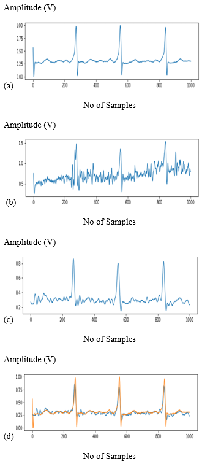
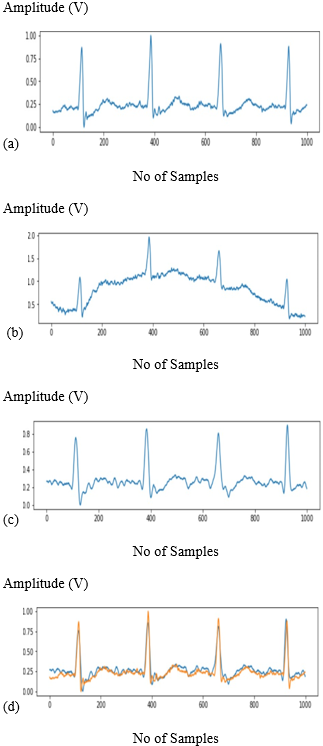
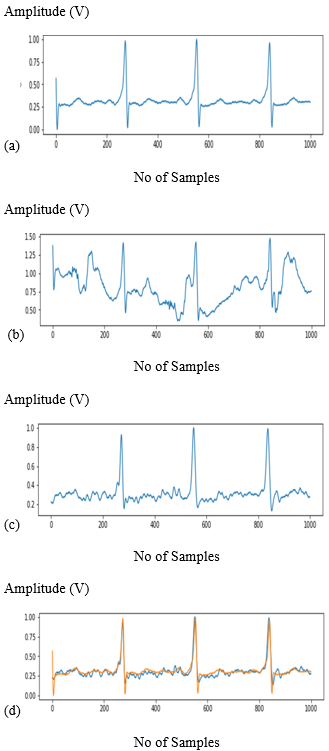

# ECG Denoising Autoencoders
## Introduction
ECG is an effective non-invasive method for the detection of detrimental diseases like arrhythmia and other coronary artery diseases. Although ECG is effervescent, it is under the influence of various noises. Of all these noises muscle artifact, electrode motion, baseline wander are the major ones that affect the ECG signal. These noises may cause deformations on ECG waveforms and mask features that are important for diagnosis. Therefore, the removal of noises from ECG signals becomes necessary. The other problem is the number of samples to be transferred, as the number of samples per second increases the strain on the device to transmit data to the cloud or connected device increases. The Autoencoder can be applied to reconstruct the clean data from its noisy version and compress the number of samples thereby, reducing the strain on the device. The proposed method of using autoencoders will be compressing the data at different levels. We used ECG signals from the MIT-BIH Arrhythmia database and added noise signals are acquired from the MIT-BIH noise stress test database. The results of the study demonstrate the superiority of Autoencoder in denoising, with lower root mean square error (RMSE), as well as higher signal to noise ratio (SNR) and normalized cross correlation (NCC). The following study shows comparison of SNR, NCC, RMSE of autoencoders for different compressions. According to the results, we believe that the proposed AE has a good application prospect in clinical practice.

## Methodology
Autoencoder is a neural network that aims to reproduce output which is similar to the input. There are various kinds of autoencoders such as variational, stacked, denoising of which denoising autoencoder is predominantly used for effective compression and noise reduction majorly used in medical, low light enhancement, speech and many more.

## Architecture
For the results below we used a 6-layer DAE architecture, in which the encoder comprises of the first three layers which maps input feature to the latent space and the last three layers makeup the decoder which reconstruct the clear version of the input. As mentioned earlier Rectified linear unit function is applied as an activation function for the first 6 layers and there is no need for activation function for the output layer. We have determined that the only changing the 3rd layer for different compressions gave optimal results. The first layer consists of 1000 neurons as input as 500 as output, the second layer consist of 500 neurons as input and 250 as output, third layer consist of 250 neurons as input and the output depend on the compression used, and the remaining layers are the inverse of first three layers (Decoder part). Down sampling takes place from layer 1-3 and up sampling takes place from layers 4-6.

## Performance evaluation Metrics
RMSE 
SNR (input) = 10×log(S/N) 
SNR (noise) = 10×log((S+N)/N) 
SNR (denoised) = 10×log (Si / Ni) 
Ni = S (pure ECG) – Si (Denoised ECG) 
Normalized Cross Correlation

## Info about data
The noise is extracted from MIT-BIH Noise Stress Test Database, which consists of electrode motion, baseline wander and muscle artifact noises. Each noise record has 650000 samples, we have extracted 200 fragments each of length 1000 samples and normalized it. We created 3 databases by adding 3 different noise to the pure database. Each noise fragment is randomly selected from the 200 fragments extracted to make it more real-time. As there are 48 records, we have a dataset with a size of 31,200 for each noise, of which 80% is taken as train data and the remaining 20% is taken as test data.

## Sample Results
### Muscle Artifact

 
(a) Pure ECG signal (b) MA added ECG signal   
(c) Denoised ECG signal(10X) (d) Denoised vs Pure Signal
 
 

### Baseline Wander

 
(a) Pure ECG signal (b) BW added ECG signal
(c) Denoised ECG signal (10X Comp) (d) Denoised vs Pure ECG
 
 

### Electrode Motion

 
(a) Pure ECG signal (b) EM added ECG signal
(c) Denoised ECG signal(10X) (d) Denoised vs Pure ECG
 
 
All the code for the used for the above documentation is provided in form of jupyter notebook, and can be used readily in google colab.